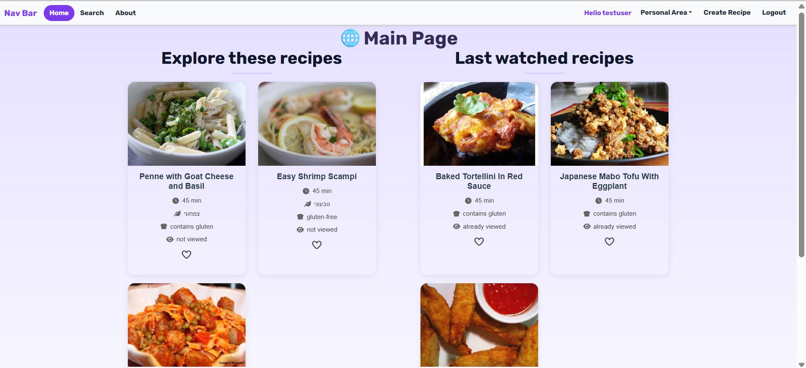
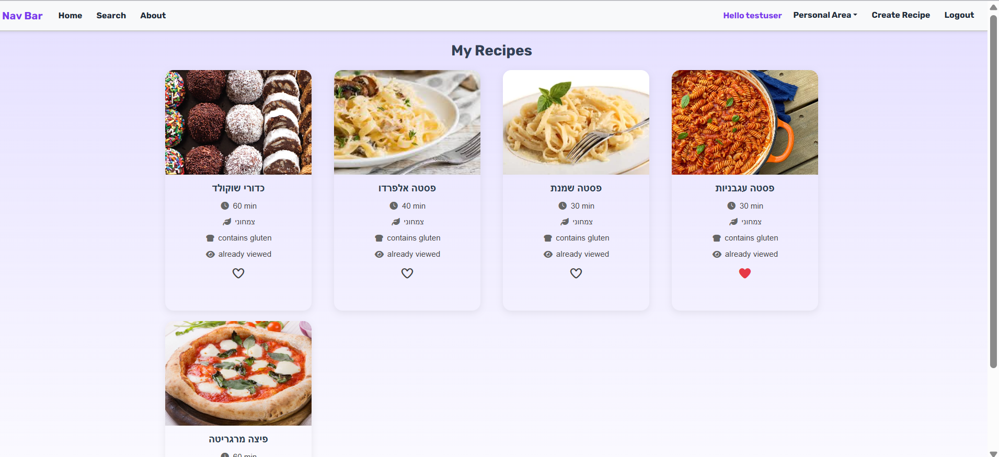
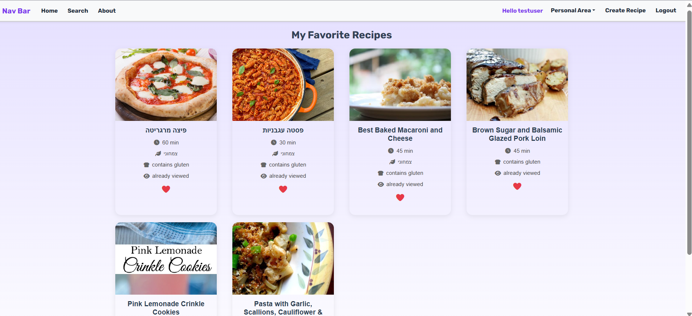
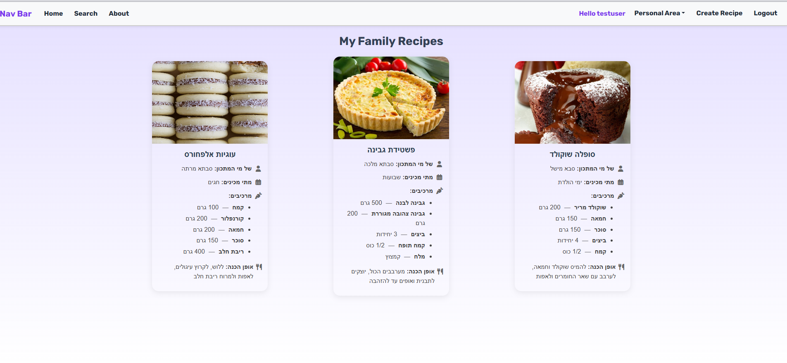

# Recipe Website 🍽️

Recipe Website is a full-stack recipe web application that I developed independently using Vue.js and Node.js. The application allows users to register and log in, search for recipes using the Spoonacular API, create and manage their own recipes, save favorite recipes, view recently opened recipes, and access personal and family recipe collections. Each recipe includes details such as cooking time, dietary information, ingredients, and preparation instructions.

## Demo Account

To explore the application, use:

**Username:** `testuser`  
**Password:** `testuser`

## Features

- User registration and authentication
- Recipe search using the Spoonacular API
- Create and manage personal recipes
- Save favorite recipes
- Recently viewed recipes
- Personal recipe collection
- Family recipe collection
- Recipe details including cooking time, dietary information, ingredients, and preparation instructions

## Technologies

- Vue.js
- JavaScript
- Node.js
- Axios
- REST API
- Spoonacular API

## Screenshots

### Home Page

### My Recipes

### Favorite Recipes

### Family Recipes

## Running the project

### Backend
cd backend  
npm install  
npm start

### Frontend
cd frontend  
npm install  
npm run serve
